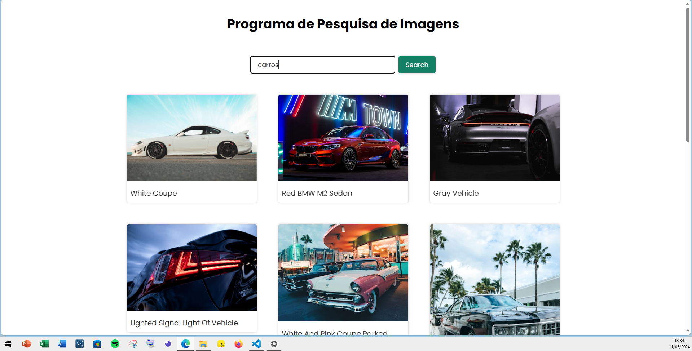

<h1>Projeto de pesquisa de imagens.</h1>

Projeto de fixação de aprendizado.

Neste projeto é realizado uma consulta nos dados em API de imagens da <a href="https://unsplash.com/pt-br" target="_blank">Unsplash</a>

Usando HTML,CSS e JS apenas!

<strong># Visualização do projeto final: 💻✅</strong>

