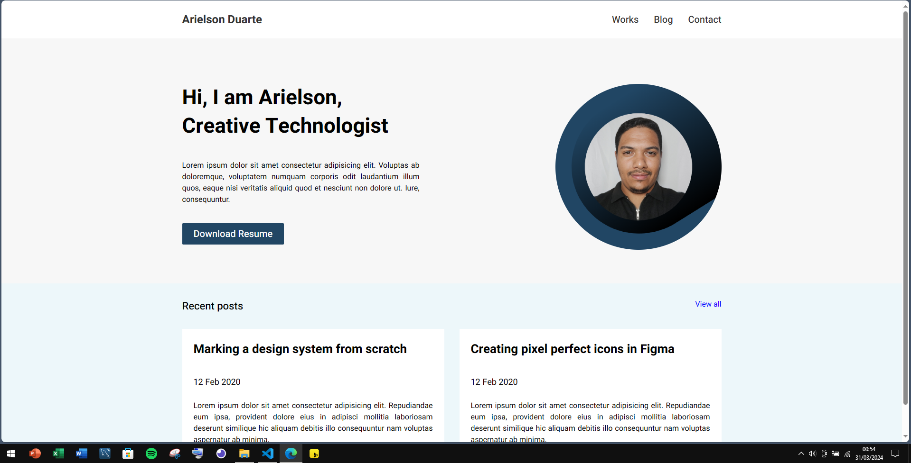
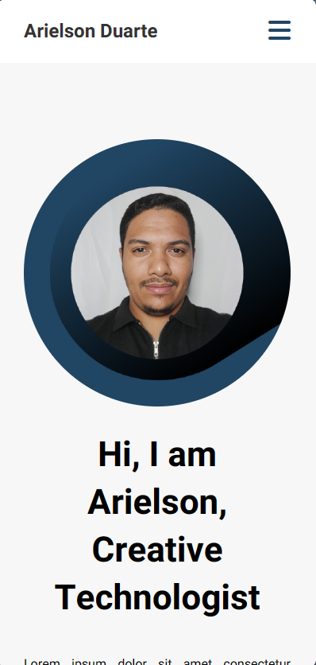
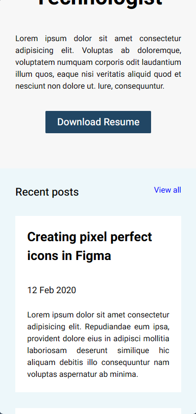
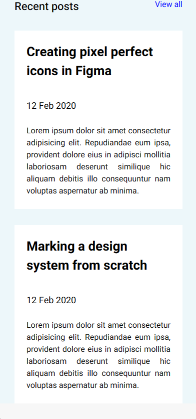

<h1>Protifólio</h1>

Projeto de fixação de aprendizado.

Usando HTML e CSS apenas!

<strong># Visualização do projeto final: 💻✅</strong>

<strong># Visualização responsiva: 📱✅</strong>

Imagem 01:

Imagem 02:

Imagem 03:

